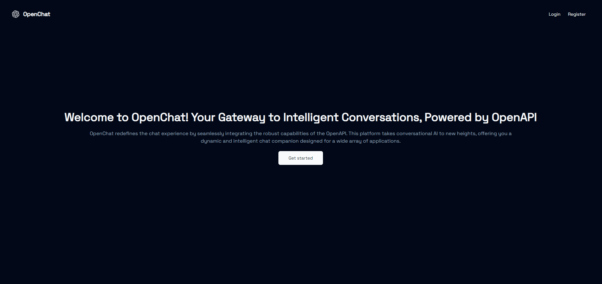
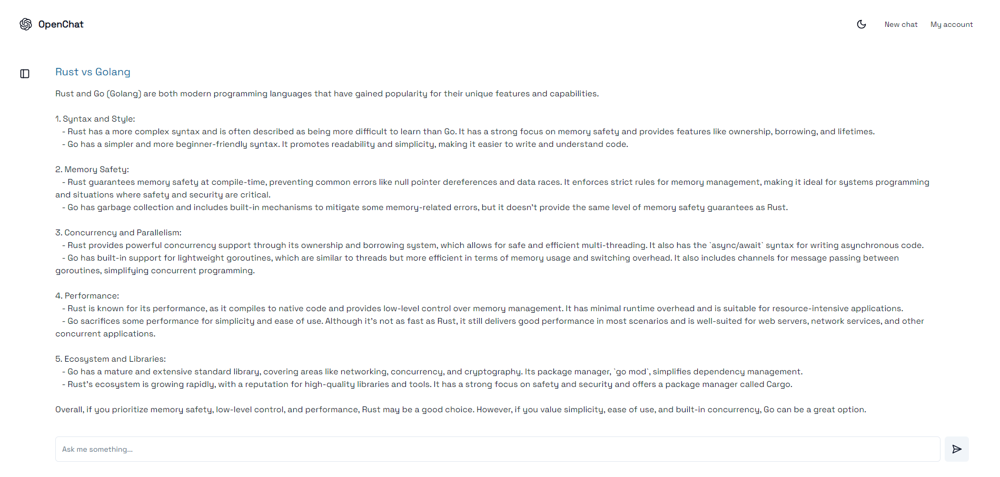

# Chatgpt-clone
This is a [Next.js](https://nextjs.org/) project bootstrapped with [`create-next-app`](https://github.com/vercel/next.js/tree/canary/packages/create-next-app).

## Getting Started

```bash
npm install
```

First, run the development server:

```bash
npm run dev
```

Open [http://localhost:3000](http://localhost:3000) with your browser to see the result.

This project uses [`next/font`](https://nextjs.org/docs/basic-features/font-optimization) to automatically optimize and load Inter, a custom Google Font.

## Tech

- NextJS 14, RSC, Server actions, useFormStatus,useOptimistic
- Shadcn-ui
- Prisma
- NextAuth
- OpenAI
- Supabase
- Postgres

## Preview






## Deploy on Vercel

Check out - https://chatgpt-clone-sigma-wheat.vercel.app/